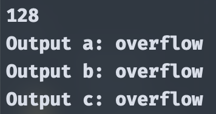

# Data Representation Homework

## Students
1. Huỳnh Cao Tuấn Kiệt - 22127219
2. Lý Đình Minh Mẫn - 22127255

## Main idea
For each type of forms, we will have a boolean array consisting of 8 elements. An element will be marked `true` if the bit in that position is `1`, and be marked `false` otherwise.
### Sign-Manitude form
For this type of number presentation, we only need to mark the MSB - which is the leftmost bit - as `1` or `0`, whether it is a positive or negative number.

When the user inputs an integer, we will convert it to binary using `7` bits. \
There's one minor problem with the number `0` in this form: it has two different presentation, and we have to take care of that when printing out the result \
The range for 8 bits numbers in this form is [-127, 127], which will be used to check if any given numbers cause overflow

### One's Complement
For this type of number presentation, we first convert the given number in base `10` to base `2`. Then, we will flip all bits - from `0` to `1` and vice versa.

This form has the same problem with the number `0` as [Sign-Manitude form](#sign-manitude-form), so we have to take care of that

The range for 8 bits numbers in this form is [-127, 127], which will be used to check if any given numbers cause overflow

### Two's Complement
For this type of number presentation, we do the exact same thing as in [One's Complement](#ones-complement). Then, we add one to the result to get the Two's Complement form

This form solves the `0` problem in the two above forms, thus allowing us to store one more number, from -128 to 127 (inclusive)

## Implementation
In our program, we have 2 classes: `BinaryNumber` and `Solution`.

The `BinaryNumber` class is used to store user's input in a boolean array, and supports converting from base `10` to base `2`.

It also supports adding one bit to the rightmost bit, change bit value at a given position, and flip the whole bit sequence.

The `Solution` class is responsible for printing out the correct answer to the screen for each form, including checking for corner cases.

## Source code

[Google Drive](https://drive.google.com/drive/folders/1GZA6OcqzHJiUQBWD7haI-X58CnbJg9JL?usp=sharing)

## Screenshots
### 1. Valid inputs
- Positive number:

- Negative number:

### 2. Out of Range Inputs

### 3. Special Case
