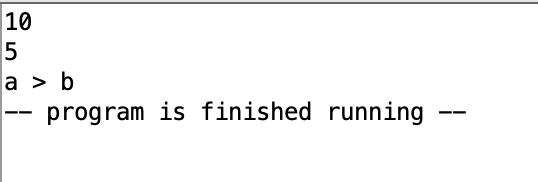
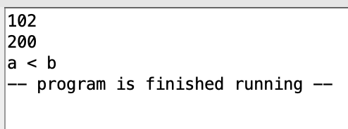
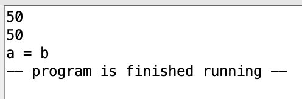

# Exercise 1

Requirement: input two integers a, b. Determine wether a > b, a < b or a = b

## Main idea

Pseudo code:

```
a, b <- input from keyboard
if a > b:
    print "a > b"
else if a < b:
    print "a < b"
else:
    print "a = b"
```

## Testing and screenshots




