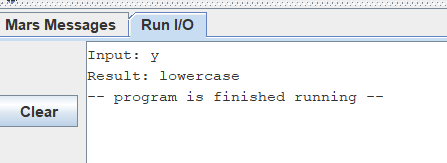
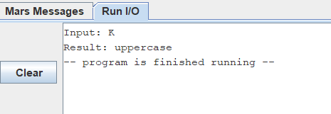

# Execise 2

Requirement: input a character and check whether it is uppercase or lowercase.

## Main idea

Pseudo code:

```
1. Read a character from the user
2. If the character's ASCII code is less than 65 (less than 'A'):
    -> Output "Invalid character" to the console and go to step 8
3. Else if the character's ASCII code is greater than 90 ('Z'):
    -> Go to step 5
4. Output "Result: uppercase" to the console and go to step 8
5. If the character's ASCII code is less than 97 ('a'):
    -> Output "Invalid character" to the console and go to step 8
6. Else if character's ASCII code is greater than 122 ('z'):
    -> Output "Invalid character" to the console and go to step 8
7. Output "Result: lowercase" to the console and go to step 8
8. Exit the program
```

## Testing and screenshots


