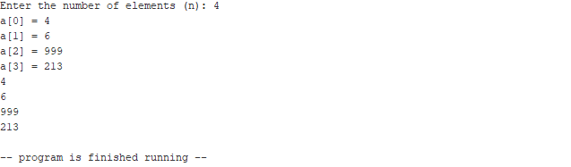

# Execise 2

Requirement: input an array and output it

## Main idea
Pseudo code of the LOOP:
```
Loop:
+ Display message 

+ Do our task (input, store the value in the address, load the value, output the value, ...)

Increment 'i' by 1
Move 'array_ptr' to the next address of the array

If 'i' is equal to 'n', end the loop
Otherwise, jump to Loop
```

## Testing and screenshots


