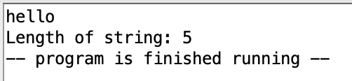
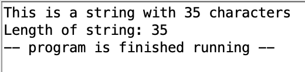

# Exercise 4

Requirement: input a string and print the length of it, using an assembly program

## Main idea

Pseudo code:

```
str <- "", length <- 0
let user input str

ptr <- address of first element of str
while value at ptr not \0 or \n:
    length <- length + 1
    ptr <- ptr + 1

print length
```

## Testing and screenshots



